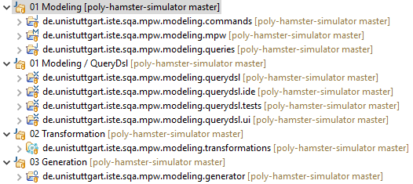
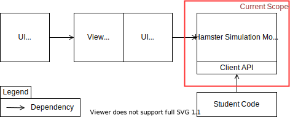
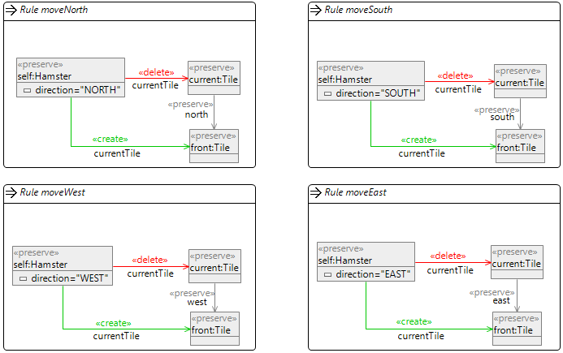

# Architecture Review 2020-12

* for master thesis _Redesigning the Hamster Simulation_
* proposal can be found in the _Colloquium Software Quality and Architecture_ ILIAS course, in the folder `2020-MastersThesisProposal-Fuksa-Hamstersimulator` (https://ilias3.uni-stuttgart.de/goto_Uni_Stuttgart_fold_2092546.html)
* further information in the GitHub Wiki
    * requirements (https://github.com/Fumapps/mpw-modeling-framework/wiki/Requirements)
    * feature diagram (https://github.com/Fumapps/mpw-modeling-framework/wiki/Features)

## Prepare the IDE

As described in the GitHub README.md (https://github.com/Fumapps/mpw-modeling-framework):

* setup the Eclipse plugins
* then run the generation workflow to generate the simulator-code: `de.unistuttgart.iste.sqa.mpw.modeling.generator/src/workflow/generator.mwe2`
    * Note: to avoid the preparation by multiple manual actions, for this review-branch generated code is commited also
    * in future a main-workflow or maven script shall be used to simplify the generation
* optionally create working sets:

* optionally open query files in a runtime eclipse instance and import the `*.modeling.queries` project
* finally open the `de.unistuttgart.iste.sqa.mpw.hamstersimulator.java` maven project

## Ideas of the architecture

The hamstersimulator is based on a core _Hamster Simulation Model_, which implements the commands and queries for the game.
The current implementation only captures this core model. The other parts _UI Logic_ and _UI Framework_ will be reused from the original PSE simulator (in case of Java).

## Model-Driven Workflow

The activity so far deals with the model-driven approach of the hamster simulator. For this the following graphic shall illustrate the main artifacts and main process steps:

### Modeling

In the _Modeling_ step the `MiniProgrammingWorld` base meta-models are designed as EMF Ecore artifacts. On a separate model file also the meta-model for commands are modeled (`Command.ecore`).

    Ecore file: `de.unistuttgart.iste.sqa.mpw.modeling.mpw/model/MiniProgrammingWorld.ecore`

On this basic metamodel a Hamstersimulator-specific model is created, which realizes the basic components:

    Ecore file: `de.unistuttgart.iste.sqa.mpw.modeling.mpw/model/Hamster.ecore`

* Territory: implements the meta-type `Stage`
* Hamster: implements the meta-type `Actor`
* HamsterGame: implements the meta-type `MiniProgrammingWorld`
* Grain: implements the meta-type `Prop`
* Wall: implements the meta-type `Prop`

On the base of this model then the behaviors are modeled:

* with the Henshin tool the commands are modeled, example `move()`
    

    Henshin file: `de.unistuttgart.iste.sqa.mpw.modeling.commands/src/game/move.henshin_diagram`
    
* with a custom DSL the queries are modeled, example `frontIsClear()`

    Query file: /de.unistuttgart.iste.sqa.mpw.modeling.queries/src/queries/hamster/frontIsClear.query

* with the same DSL also constraints (preconditions, postconditions, invariants)  can be modeled, example 

    Query file: /de.unistuttgart.iste.sqa.mpw.modeling.queries/src/queries/hamster/frontIsClear.query

The output artifacts of the _Modeling_ step are the `*.query`, `*.henshin` and `*.ecore` files.  

Note: the `HamsterViewModel.ecore` and `stereotypes/ViewModel.ecore` packages are currently not further used, they currently only lead to the generation of some unused classes in the case of Java, since the PSE view-logic is planned to be reused. But for C++ they are planned to be implemented.

### Transformation

The _Transformation_ workflow step is the part with most logic of this model-driven approach. It takes the modeled artifacts and creates generation friendly artifacts from them.

For this intermediate meta-models are used:

* _commandBehavior_ (`de.unistuttgart.iste.sqa.mpw.modeling.transformations/model/CommandBehaviors.ecore`)
    * mainly for transformation: `CommandTransformation.qvto`
* _queryBehavior_ (`de.unistuttgart.iste.sqa.mpw.modeling.transformations/model/QueryBehaviors.ecore`)
    * mainly for transformation: `QueryTransformation.qvto`
* _generationAnnotations_ (`de.unistuttgart.iste.sqa.mpw.modeling.transformations/model/GenerationAnnotations.ecore`)
    * mainly for transformation: `GenerationClassesTransformation.qvto`
    
Besides the intermediate meta-models for behavior here also roles and facades are transformed (as extended Ecore models).

* Role: in the Hamster-Simulator there are two basic roles:
    * Game-Role: this role represents the game API for the Client, like moving the hamster or picking grains
    * Editor-Role: this role is used for builing a territory with its contents like initializing or placing props on the stage
    * (they are processed with transformation `RoleTransformation.qvto`)

* Game Facade: The client-API classes `Hamster` and `Territory` are simple facades on the game-roles. This API shall be relatively close to the PSE Hamster API.
* Stage Builder Facade: While the generation of persistence is currently not a target of this work, at least the `TerritoryBuilder` is generated from the given editor-commands. It can be used as a fluent API to simply build territories. 

Hint: after generation under `de.unistuttgart.iste.sqa.mpw.modeling.generator/debugout` the intermediate models are persisted as XMI / Ecore files.

The output artifacts of the _Transformation_ step are transformed ecore files which have the query and command behavior models embedded in their `EOperation`s as `EAnnotation`s.

Note: currently the generator has still much logic, it is planned to refactor this logic into the transformation step also and place it in the ecore-files as EAnnotation (by transforming to `GenerationAnnotations.ecore`)

### Generation

In the _Generation_ workflow step the intermediate models and extended Ecore models are used to generate concrete code by using Xpand templates.
While for the behavior models (_queryBehavior_ and _commandBehavior_) custom Xtend logic is currently placed in the generator, the generation of the facade is based on custom `EAnnotations` which are defined in as `GenerationAnnotation` instances.
With this approach the generation code is very primitive and much easier to migrate to other languages.

Like mentioned above, it is planned to use this approach also for _queryBehavior_ and _commandBehavior_ to move logic to the transformation step.

The generation and whole transformation process is controlled by the MWE2 workflow (`de.unistuttgart.iste.sqa.mpw.modeling.generator/src/workflow/generator.mwe2`). 

## Features planned, but missing

### Documentation & Modeling

* generate valid JML statements from constraints
* more OCL validation for henshin commands used as input (`de.unistuttgart.iste.sqa.mpw.modeling.commands/src/CommandValidation.ocl`)
* enrich the QueryDSL by more autocompletion assitance (by using Xtext ScopeProviders)

### Generation

* model tests by a DSL, generate JUnit testcases from them (inherit a helpful TestCaseBase)
* generate custom exceptions for constraints

## Next major milestones

### JavaFX rendering

* integrate the viewmodel with observable behavior to the JavaFX UI and finish the basic Java Simulator

### Port to C++

* adapt the generation code for C++
* implement viewlogic
* integrate in a C++ graphics framework, e.g. SDL
